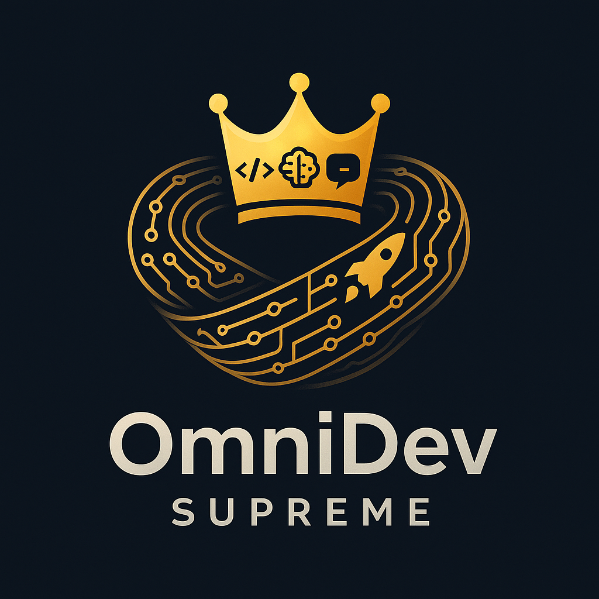

# OmniDev Supreme 👑

<div align="center">
  
</div>

**The One Platform to Rule Them All**

OmniDev Supreme is the unified AI development orchestrator that consolidates 10+ AI development systems into one ultimate platform. It combines agent-based architecture, multi-model orchestration, and advanced memory systems to provide an unparalleled development experience.

## 🎯 Vision

Consolidate scattered AI development systems into one unified platform that can:
- **Architect** - Design and plan software projects
- **Code** - Generate high-quality code in any language
- **Test** - Create and run comprehensive tests
- **Review** - Analyze and improve code quality
- **Fix** - Automatically repair issues and bugs
- **Deploy** - Handle containerization and deployment
- **Evolve** - Learn and improve over time

## 🏗️ Architecture

<details>
<summary><strong>Core Components</strong></summary>

### 1. **Unified Agent Registry**
- **OBELISK Agents**: Multi-model task routing and execution
- **The-Agency Agents**: Full lifecycle development automation
- **AI-Dev-Team Agents**: MCP protocol-based team coordination
- **Village-of-Intelligence**: Self-evolving agent ecosystem
- **MeistroCraft System**: GPT-4 orchestration with Claude execution

### 2. **Multi-Model Orchestration**
- **OpenAI Models**: GPT-4o, GPT-4, GPT-3.5 Turbo
- **Anthropic Models**: Claude 3.5 Sonnet, Claude 3 Opus
- **Local Models**: Ollama (Llama 3.1, CodeLlama, Mistral)
- **Specialized Models**: Chatterbox TTS, Dia Dialogue, ComfyUI Visual

### 3. **Universal Memory System**
- **Vector Memory**: FAISS + Sentence Transformers for semantic search
- **Relational Memory**: PostgreSQL with structured data
- **Session Memory**: Redis for active conversations
- **Knowledge Graph**: Connected relationships and dependencies

### 4. **Unified Web Interface**
- **Monaco Editor**: VS Code-style editing with AI assistance
- **Agent Dashboard**: Real-time monitoring and control
- **Project Manager**: Multi-project workspace management
- **Memory Explorer**: Knowledge graph visualization

</details>

## 🚀 Features

### **AI-Powered Development**
- Multi-agent collaboration for complex tasks
- Intelligent task routing to appropriate agents
- Real-time code generation and assistance
- Automated testing and quality assurance

### **Advanced Memory Management**
- Vector similarity search for code and documentation
- Knowledge graph relationships between components
- Persistent session context across interactions
- Cross-agent memory sharing and learning

### **Comprehensive Integration**
- GitHub workflow automation
- Docker containerization support
- CI/CD pipeline integration
- Multi-model AI orchestration

### **Production-Ready Infrastructure**
- Docker containerization
- Kubernetes deployment
- Monitoring and alerting
- Security and compliance

## 📁 Project Structure

```
omnidev-supreme/
├── backend/
│   ├── agents/          # Unified agent systems
│   ├── memory/          # Memory management
│   ├── orchestration/   # AI model routing
│   ├── integrations/    # External services
│   └── api/            # REST/GraphQL/WebSocket
├── frontend/
│   ├── components/      # React components
│   ├── pages/          # Application pages
│   ├── hooks/          # Custom React hooks
│   └── utils/          # Utility functions
├── shared/
│   ├── types/          # TypeScript types
│   ├── constants/      # Shared constants
│   └── utils/          # Shared utilities
└── infrastructure/
    ├── docker/         # Docker configurations
    ├── kubernetes/     # K8s manifests
    └── monitoring/     # Monitoring setup
```

## 🛠️ Technology Stack

<details>
<summary><strong>Backend</strong></summary>

- **Framework**: FastAPI with Python 3.11+
- **Database**: PostgreSQL (primary), Redis (cache), SQLite (sessions)
- **Vector Store**: FAISS + Qdrant
- **Queue**: Celery + Redis
- **WebSocket**: FastAPI WebSocket
- **ORM**: SQLAlchemy

</details>

<details>
<summary><strong>Frontend</strong></summary>

- **Framework**: React 18 + TypeScript
- **Editor**: Monaco Editor
- **State Management**: Redux Toolkit + RTK Query
- **Styling**: Tailwind CSS + Headless UI
- **Build Tool**: Vite + ESBuild

</details>

<details>
<summary><strong>AI/ML</strong></summary>

- **OpenAI**: GPT-4o, GPT-4, GPT-3.5
- **Anthropic**: Claude 3.5 Sonnet, Claude 3 Opus
- **Local Models**: Ollama integration
- **Orchestration**: LangChain + Custom routing
- **Embeddings**: OpenAI + Sentence Transformers

</details>

<details>
<summary><strong>Infrastructure</strong></summary>

- **Containerization**: Docker + Docker Compose
- **Orchestration**: Kubernetes
- **Monitoring**: Prometheus + Grafana
- **Logging**: ELK Stack
- **Security**: HashiCorp Vault + OAuth2

</details>

## 🚀 Quick Start

### Prerequisites
- Docker and Docker Compose
- Python 3.11+
- Node.js 18+
- API keys for OpenAI and Anthropic

### Installation

```bash
# Clone the repository
git clone https://github.com/meistro57/omnidev-supreme.git
cd omnidev-supreme

# Set up environment variables
cp .env.example .env
# Edit .env with your API keys

# Start with Docker Compose
docker-compose up --build

# Or run locally
pip install -r requirements.txt
cd frontend && npm install
npm run dev
```

### Usage

1. **Open Web Interface**: Navigate to `http://localhost:3000`
2. **Create Project**: Use the project manager to create a new project
3. **Start Coding**: Open the Monaco editor and start coding with AI assistance
4. **Deploy**: Use the deployment agents to containerize and deploy your application

## 📊 Consolidated Systems

<details>
<summary><strong>AI Development Systems</strong></summary>

- **OBELISK**: Multi-agent development OS with vector memory
- **MeistroCraft**: Web IDE + GPT-4/Claude orchestration
- **The-Agency**: 6 specialized agents for full lifecycle
- **AI-Development-Team**: MCP server development team
- **Artificial-Village-of-Intelligence**: Self-evolving agent ecosystem

</details>

<details>
<summary><strong>Audio/Creative Systems</strong></summary>

- **Chatterbox**: Production-grade TTS system
- **Dia**: Text-to-dialogue model
- **ComfyUI**: Visual AI engine
- **SoulscribeGPT**: AI writing assistant

</details>

<details>
<summary><strong>Supporting Systems</strong></summary>

- **MeistroVerse**: Behavioral evolution system
- **Gateway Trainer**: Audio processing tools

</details>

## 🎯 Roadmap

### **Phase 1: Foundation (✅ COMPLETE)**
- [x] Architecture design
- [x] Repository setup
- [x] Agent registry system
- [x] Memory architecture (Vector + Relational + Session)
- [x] Multi-model orchestration (OpenAI + Anthropic + Ollama)

### **Phase 2: Core Integration (✅ COMPLETE)**
- [x] **The-Agency Complete Integration (6/6 agents)**
  - [x] 🏗️ Architect Agent - Project planning and task decomposition
  - [x] 💻 Coder Agent - Multi-language code generation (20+ languages)
  - [x] 🧪 Tester Agent - Comprehensive test generation
  - [x] 🔍 Reviewer Agent - Code quality analysis and security review
  - [x] 🔧 Fixer Agent - Bug fixing and issue resolution
  - [x] 🚀 Deployer Agent - Deployment and DevOps configuration
- [x] **MeistroCraft Complete Integration (5/5 agents)**
  - [x] 🎯 GPT-4 Orchestrator Agent - Strategic task planning and orchestration
  - [x] 🎭 Claude Executor Agent - Claude CLI integration and execution
  - [x] 📋 Session Manager Agent - Persistent sessions and workspace coordination
  - [x] 🐙 GitHub Integrator Agent - Repository management and workflow automation
  - [x] 📊 Token Tracker Agent - Usage monitoring and cost analysis
- [x] **OBELISK Complete Integration (7/7 agents)**
  - [x] 🏗️ Code Architect Agent - High-level architecture plans and system designs
  - [x] 🔧 Code Generator Agent - Code generation from specifications and plans
  - [x] 🔍 Quality Checker Agent - Comprehensive code quality analysis and security review
  - [x] 🧪 Test Harness Agent - Automated comprehensive test suite generation
  - [x] 💡 Ideas Agent - Creative feature brainstorming and innovation suggestions
  - [x] 🎨 Creativity Agent - Creative idea refinement and enhancement
  - [x] 📊 Self-Scoring Agent - Output evaluation and improvement suggestions
- [x] Complete multi-agent workflow pipeline with hybrid orchestration
- [x] Advanced quality assurance and creative enhancement workflows
- [x] **18/29 Core Agents Successfully Integrated**
- [x] **Foundation Systems Fully Operational**

### **Phase 3: Advanced Features (🚧 IN PROGRESS)**
- [x] **AI-Development-Team Integration (6/6 agents)**
  - [x] 👥 Project Manager Agent - Project coordination and management
  - [x] 🏗️ Architect Agent - System architecture and design
  - [x] 👨‍💻 Developer Agent - Code development and implementation
  - [x] 🧪 QA Agent - Quality assurance and testing
  - [x] 🔧 DevOps Agent - Infrastructure and deployment
  - [x] 📝 Review Agent - Code review and documentation
- [ ] **Village-of-Intelligence Integration (5 village agents)**
  - [ ] 🧠 Thinker Agent - Strategic thinking and planning
  - [ ] 🔨 Builder Agent - Construction and implementation
  - [ ] 🎨 Artist Agent - Creative design and aesthetics
  - [ ] 🛡️ Guardian Agent - Security and protection
  - [ ] 📚 Trainer Agent - Learning and knowledge management
- [ ] **Unified Web Interface**
  - [ ] Monaco Editor integration
  - [ ] Real-time agent dashboard
  - [ ] Multi-project workspace
  - [ ] Memory explorer visualization
- [ ] **Knowledge Graph Implementation**
  - [ ] Entity relationship mapping
  - [ ] Semantic connections
  - [ ] Graph-based querying
- [ ] **Advanced Agent Coordination**
  - [ ] Dynamic task routing
  - [ ] Multi-agent collaboration
  - [ ] Conflict resolution
- [ ] **Production Deployment**
  - [ ] Docker containerization
  - [ ] Kubernetes orchestration
  - [ ] CI/CD pipeline setup
- [ ] **Performance Optimization**
  - [ ] Caching strategies
  - [ ] Database optimization
  - [ ] Load balancing

### **Phase 4: Ecosystem Completion**
- [ ] **Audio System Integration**
  - [ ] Chatterbox TTS integration
  - [ ] Dia dialogue system
  - [ ] Voice interface
- [ ] **Creative Tools Integration**
  - [ ] ComfyUI visual AI
  - [ ] SoulscribeGPT writing
  - [ ] Content generation
- [ ] **Advanced Monitoring**
  - [ ] Prometheus metrics
  - [ ] Grafana dashboards
  - [ ] Alert systems
- [ ] **Full Documentation**
  - [ ] API documentation
  - [ ] User guides
  - [ ] Developer docs

## 🤝 Contributing

We welcome contributions! Please see our [Contributing Guide](CONTRIBUTING.md) for details.

<details>
<summary><strong>Development Setup</strong></summary>

```bash
# Backend development
cd backend
pip install -e .
python -m uvicorn main:app --reload

# Frontend development
cd frontend
npm install
npm run dev

# Run tests
pytest backend/tests/
npm test
```

</details>

## 📄 License

This project is licensed under the MIT License - see the [LICENSE](LICENSE) file for details.

## 🙏 Acknowledgments

- OpenAI for GPT models
- Anthropic for Claude models
- The open-source community for tools and libraries
- All contributors to the individual systems being consolidated

---

**Status**: 🚧 In Active Development  
**Current Phase**: Advanced Features (Phase 3)  
**Latest Achievement**: ✅ AI-Development-Team Complete - 24/29 Core Agents Successfully Integrated  
**Next Milestone**: Village-of-Intelligence Integration (5 village agents) + Web Interface

Built with ❤️ by the OmniDev Supreme team