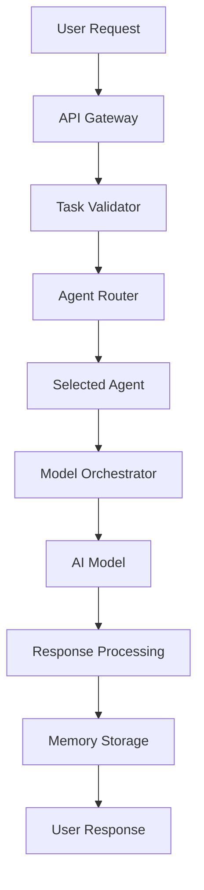
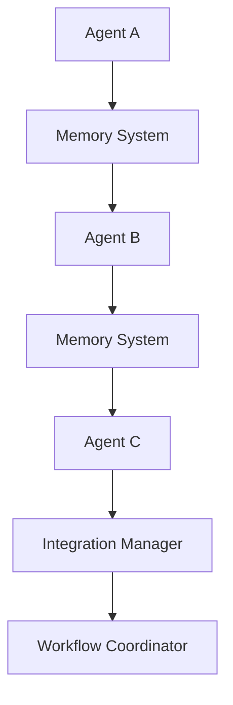
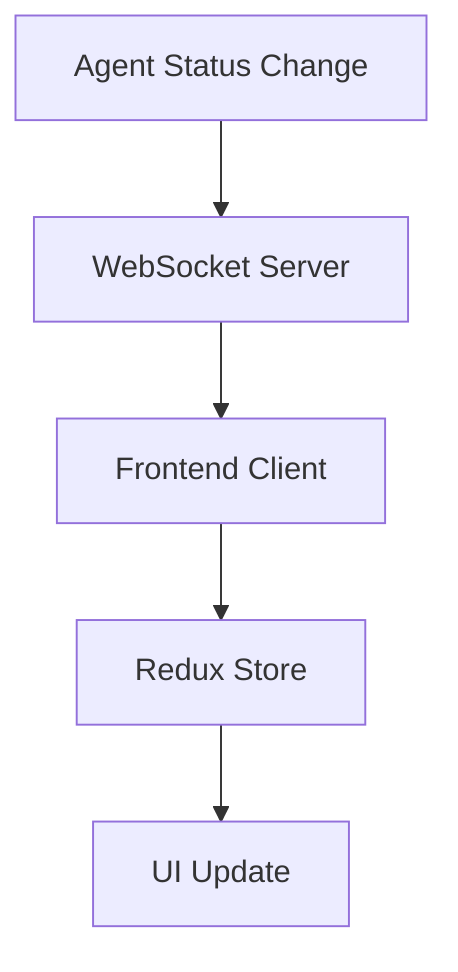

# System Overview

A comprehensive overview of the OmniDev Supreme platform architecture, designed to consolidate 29 specialized AI agents into a unified development environment.

## 🏗️ High-Level Architecture

OmniDev Supreme follows a layered architecture pattern with clear separation of concerns:

```
┌─────────────────────────────────────────────────────────────┐
│                    🌐 Presentation Layer                    │
│                React + TypeScript + Monaco                 │
│                    WebSocket + Redux                       │
└─────────────────────────────────────────────────────────────┘
                              │
┌─────────────────────────────────────────────────────────────┐
│                     🔌 API Gateway Layer                    │
│                   FastAPI + WebSocket                      │
│                REST + GraphQL + WebSocket                  │
└─────────────────────────────────────────────────────────────┘
                              │
┌─────────────────────────────────────────────────────────────┐
│                  🤖 Agent Orchestration Layer               │
│                  29 Specialized AI Agents                  │
│              Integration Manager + Registry                │
└─────────────────────────────────────────────────────────────┘
                              │
┌─────────────────────────────────────────────────────────────┐
│                   🧠 Intelligence Layer                     │
│                  Model Orchestration                       │
│              OpenAI + Anthropic + Ollama                   │
└─────────────────────────────────────────────────────────────┘
                              │
┌─────────────────────────────────────────────────────────────┐
│                    💾 Data Layer                            │
│              Memory System + Knowledge Graph               │
│           Vector + Relational + Session Storage            │
└─────────────────────────────────────────────────────────────┘
```

## 🎯 Design Principles

### 1. **Unified Interface**
- Single web interface for all 29 agents
- Consistent user experience across all systems
- Monaco Editor for VS Code-style development

### 2. **Modular Architecture**
- Each agent system is independently deployable
- Clear separation between different agent types
- Pluggable architecture for future extensions

### 3. **Intelligent Orchestration**
- Automatic task routing based on agent capabilities
- Load balancing across available agents
- Multi-agent workflow coordination

### 4. **Scalability**
- Horizontal scaling of agent instances
- Distributed processing capabilities
- Efficient resource utilization

### 5. **Reliability**
- Robust error handling and recovery
- Health monitoring and alerting
- Graceful degradation under load

## 🔧 Core Components

### **1. Agent Registry System**
- **Purpose**: Central registry for all 29 agents
- **Components**:
  - `BaseAgent`: Abstract base class for all agents
  - `AgentMetadata`: Configuration and capability metadata
  - `AgentStatus`: Runtime status tracking
  - `AgentType`: Categorization enumeration

### **2. Integration Manager**
- **Purpose**: Coordinates agent lifecycle and interactions
- **Responsibilities**:
  - Agent registration and initialization
  - Task routing and load balancing
  - Multi-agent workflow orchestration
  - Cross-system communication

### **3. Memory System**
- **Purpose**: Unified knowledge storage and retrieval
- **Components**:
  - `Vector Memory`: Semantic search with FAISS
  - `Relational Memory`: Structured data with SQLite
  - `Session Memory`: Context persistence
  - `UnifiedMemoryManager`: Coordinated access

### **4. Model Orchestration**
- **Purpose**: Intelligent AI model routing
- **Features**:
  - Multi-provider support (OpenAI, Anthropic, Ollama)
  - Task complexity-based routing
  - Cost optimization
  - Performance monitoring

### **5. Web Interface**
- **Purpose**: Unified user interface
- **Technologies**:
  - React 18 + TypeScript
  - Monaco Editor integration
  - Redux Toolkit state management
  - WebSocket real-time updates

## 🔄 Data Flow

### **1. Request Processing**


### **2. Agent Interaction**


### **3. Real-time Updates**


## 🏛️ Service Architecture

### **Backend Services**

#### **1. Core API Service**
- **Technology**: FastAPI with Python 3.11+
- **Responsibilities**:
  - REST API endpoints
  - WebSocket connections
  - Authentication and authorization
  - Request validation and routing

#### **2. Agent Services**
- **Technology**: Python async/await
- **Responsibilities**:
  - Agent lifecycle management
  - Task execution and monitoring
  - Inter-agent communication
  - Error handling and recovery

#### **3. Memory Services**
- **Technology**: SQLite + FAISS + Redis
- **Responsibilities**:
  - Knowledge storage and retrieval
  - Vector similarity search
  - Session management
  - Cache management

#### **4. Model Services**
- **Technology**: Multi-provider integration
- **Responsibilities**:
  - AI model routing
  - Request/response processing
  - Cost tracking and optimization
  - Performance monitoring

### **Frontend Services**

#### **1. Web Application**
- **Technology**: React 18 + TypeScript
- **Responsibilities**:
  - User interface rendering
  - State management
  - Real-time updates
  - Monaco Editor integration

#### **2. WebSocket Client**
- **Technology**: Socket.io
- **Responsibilities**:
  - Real-time communication
  - Event handling
  - Connection management
  - Error recovery

## 🔐 Security Architecture

### **1. Authentication**
- JWT-based authentication
- Multi-factor authentication support
- Session management
- Token refresh mechanisms

### **2. Authorization**
- Role-based access control (RBAC)
- Agent-specific permissions
- API endpoint protection
- Resource-level security

### **3. Data Protection**
- End-to-end encryption
- Data anonymization
- Audit logging
- Compliance frameworks

### **4. Network Security**
- HTTPS/WSS encryption
- Rate limiting
- DDoS protection
- API key management

## 📊 Performance Architecture

### **1. Caching Strategy**
- Redis for session caching
- Vector cache for embeddings
- API response caching
- Static asset optimization

### **2. Load Balancing**
- Agent instance load balancing
- Database connection pooling
- Request queuing
- Circuit breaker patterns

### **3. Monitoring**
- Health check endpoints
- Performance metrics
- Error tracking
- Usage analytics

### **4. Scalability**
- Horizontal agent scaling
- Database sharding
- CDN integration
- Container orchestration

## 🌐 Deployment Architecture

### **1. Container Strategy**
- Docker containerization
- Kubernetes orchestration
- Microservice deployment
- Service mesh integration

### **2. Infrastructure**
- Cloud-native deployment
- Auto-scaling groups
- Load balancers
- Database clusters

### **3. CI/CD Pipeline**
- GitHub Actions integration
- Automated testing
- Deployment automation
- Rollback capabilities

## 🔧 Configuration Management

### **1. Environment Configuration**
- Multi-environment support
- Environment-specific settings
- Secret management
- Configuration validation

### **2. Agent Configuration**
- Agent-specific parameters
- Dynamic configuration updates
- A/B testing support
- Feature flags

### **3. System Configuration**
- Resource limits
- Timeout settings
- Retry policies
- Performance tuning

## 📈 Monitoring & Observability

### **1. Metrics Collection**
- Agent performance metrics
- System health metrics
- User interaction metrics
- Business metrics

### **2. Logging**
- Structured logging
- Log aggregation
- Error tracking
- Audit trails

### **3. Alerting**
- Real-time alerts
- Escalation policies
- Notification channels
- Incident management

### **4. Tracing**
- Distributed tracing
- Request correlation
- Performance profiling
- Bottleneck identification

## 🚀 Future Architecture

### **1. Planned Enhancements**
- Edge computing integration
- Multi-region deployment
- Advanced AI model support
- Plugin architecture

### **2. Scalability Improvements**
- Distributed agent clusters
- Advanced caching strategies
- Performance optimizations
- Resource management

### **3. Intelligence Upgrades**
- Knowledge graph expansion
- Advanced reasoning capabilities
- Multi-modal AI integration
- Autonomous agent behaviors

---

<div align="center">
  <p><strong>🏗️ Architecture designed for scale, reliability, and extensibility</strong></p>
  <p>Built to handle enterprise-grade workloads with 29 specialized AI agents.</p>
  
  <a href="core-components.md">
    <strong>Explore Core Components →</strong>
  </a>
</div>

---

*Last updated: December 2024 | [Edit this page](https://github.com/meistro57/omnidev-supreme/edit/main/wiki/architecture/system-overview.md)*